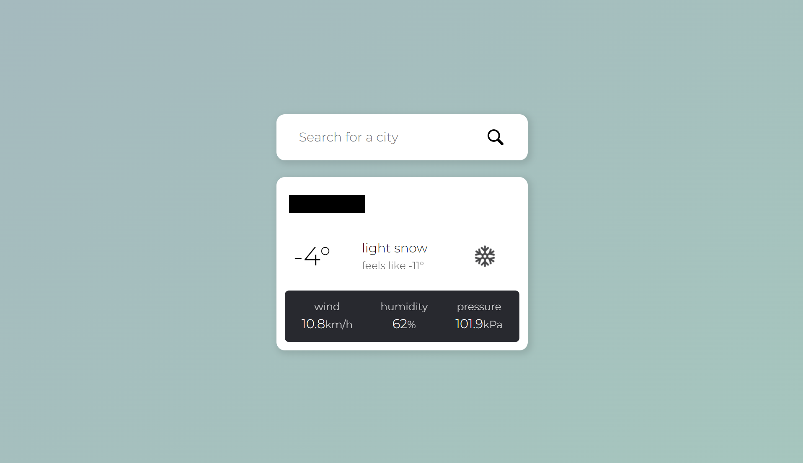
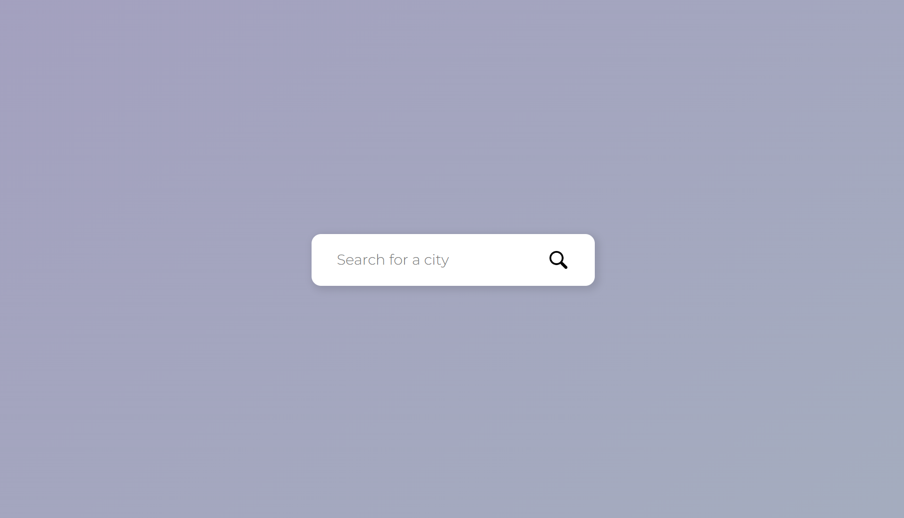
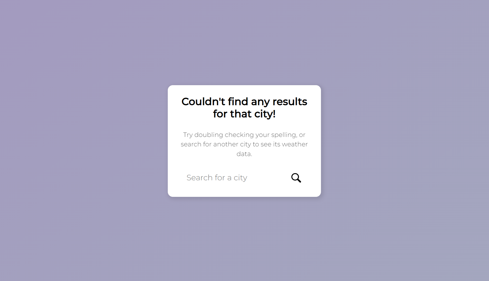
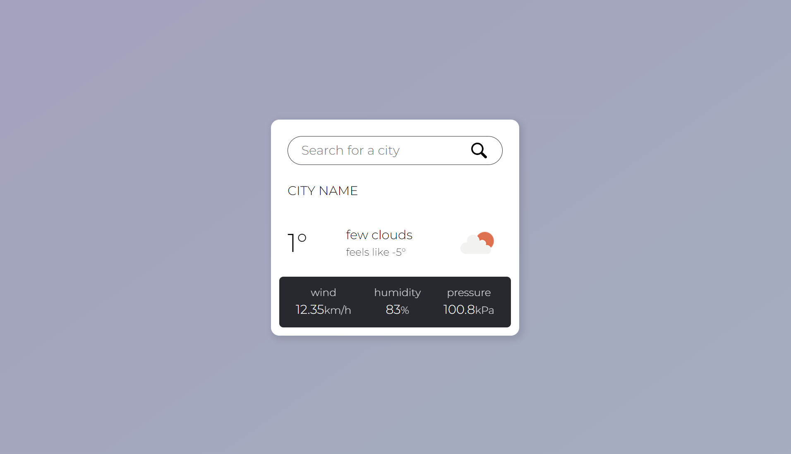

# Node.JS Weather App

## Project Details

This is a small weather widget I made using Node.JS, the OpenWeather API, the Express framework, and EJS templating.
It can provide weather data for your local area including temperature, weather conditions, wind speeds, humidity, and pressure.
Moving forward I want to add more weather data to the results.

## Notice Before Using

For security purposes, the apiKey field in weather.js was made blank before sharing the code.
You can check out OpenWeather [here](https://openweathermap.org/) to sign up for a free API key, and use it to search for whichever cities you would like!

## Updates

- March 7th, 2023: First solution for error handling. After a bit of research and some experimenting, I implemented a way to prevent invalid city names from breaking the program. The section of code that normally grabs and displays the weather data now throws an error and redirects users to an error page when an invalid city name is entered. I'm still keeping an eye out for what's considered best practice for this situation, and will continue to update my solution as I go.

- March 1st, 2023: First test implementing a search bar. This is my first time attempting to create a search bar feature, so there's some research I need to do on error handling before I continue working on the project so that invalid city names don't cause issues.

