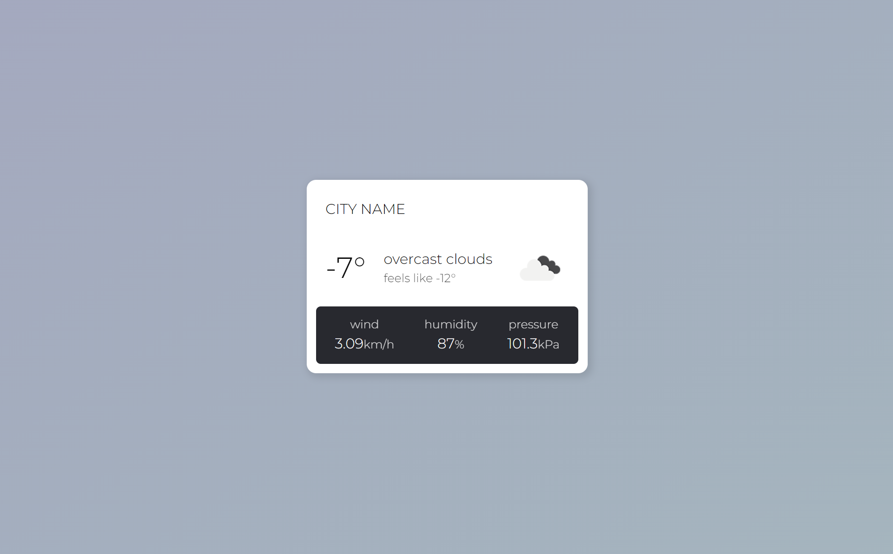

# Node.JS Weather App

## Project Details

This is a small weather widget I made using Node.JS, the OpenWeather API, the Express framework, and EJS templating.
It can provide weather data for your local area including temperature, weather conditions, wind speeds, humidity, and pressure.
Moving forward I want to add more features such as the ability to search for and choose a city from within the web app.

## Notice Before Using

For privacy and security purposes, the city and apiKey fields in weather.js were made blank before sharing the code.
You can check out OpenWeather [here](https://openweathermap.org/) to sign up for a free API key, and from there you can set the city to wherever you would like!
