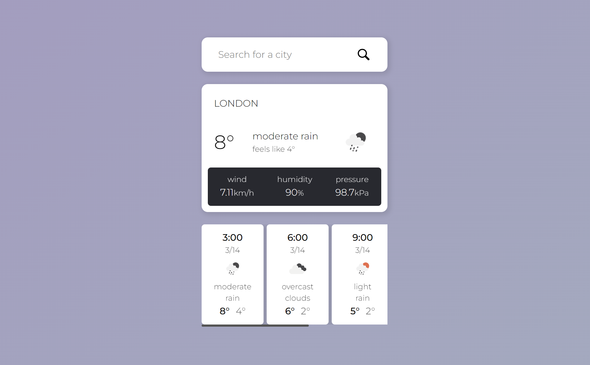

# Node.JS Weather App

## Project Details

This is a small weather widget I made using Node.JS, the OpenWeather API, the Express framework, and EJS templating.
It can provide weather data for your local area including temperature, weather conditions, wind speeds, humidity, and pressure.
Moving forward I want to add more weather data to the results.

## Notice Before Using

For security purposes, the apiKey field in weather.js was made blank before sharing the code.
You can check out OpenWeather [here](https://openweathermap.org/) to sign up for a free API key, and use it to search for whichever cities you would like!

## Updates

- March 21, 2023:
    - Current weather and forecast are now two separate sets of data, fixing the issue mentioned in the previous update.
    - Request has been fully replaced by Fetch.

- March 13, 2023: 
    - Added weather forecast in 3 hour increments.
    - "current weather" being displayed is the data from the first element in the forecast array, meaning its not actually the current weather (ahead by 3 hours). This is only temporary while I work on displaying the data separately

- March 7, 2023: 
    - First time attempting to implement error handling.
    - Invalid city names will redirect to an error page.

- March 1, 2023: 
    - First test implementing a search bar.
